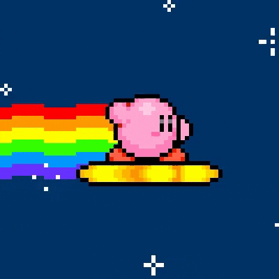
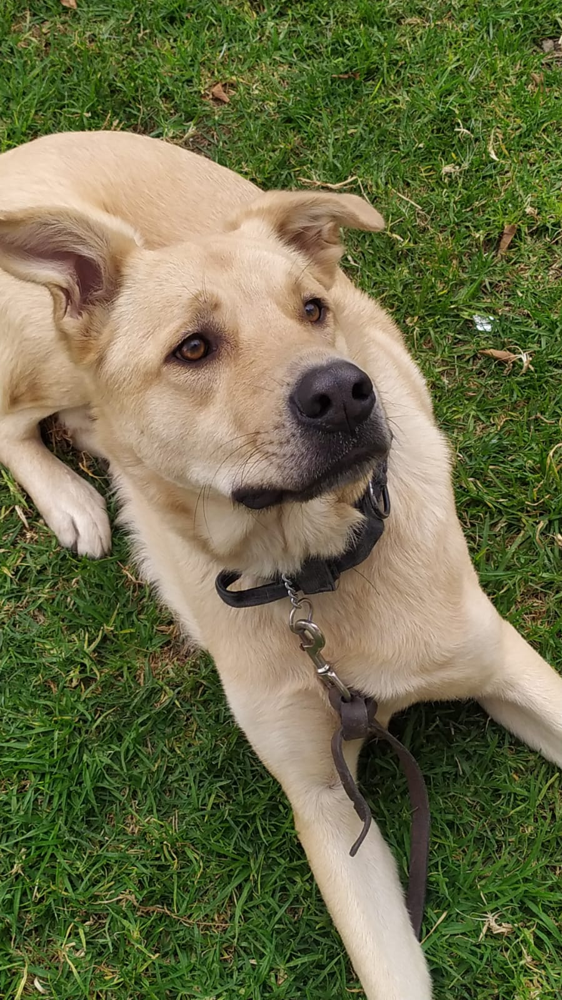

### Hello I´m Ernesto Nieves 👋 🐧

I'm 24 years old , Fullstack Development from Mexico 
--------------
# Hobbies: 🤾‍♂️
- Play videogames (Gaming addict)🎮
- Read a book  📖
- Listen to music (Good music obviously ) 🎵
- Walking with my dog  (Aquiles the most crazy) 🐶
- Watch series and movies (Anime and other things)🎥
--------------
# Lenguages & tools 🛠

  
  
  
  
  
  
  
  
  
  
  
  
  
  
  
  
  
  
  

---------------------
# Other 

-----------------------------
# Other things 🐕 🌭

Aquiles and Otis(My dogs):
  
 <!-- wi*quL3fcV -->

------------
# GitHub Stats
<picture>
  <source media="(prefers-color-scheme: dark)" srcset="https://raw.githubusercontent.com/maurodesouza/maurodesouza/output/pacman-contribution-graph-dark.svg">
  <source media="(prefers-color-scheme: light)" srcset="https://raw.githubusercontent.com/maurodesouza/maurodesouza/output/pacman-contribution-graph.svg">
  
</picture>
