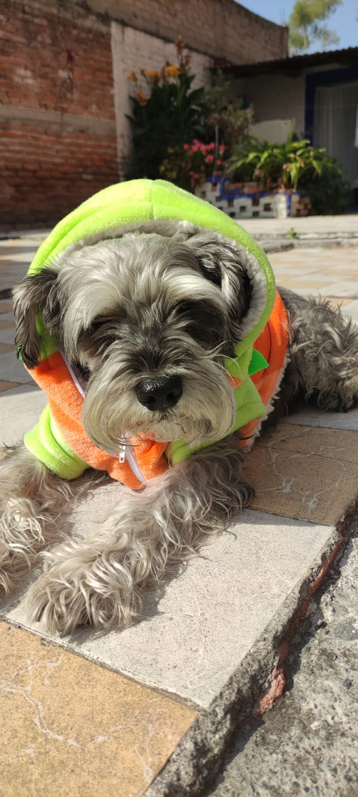

### Hello I´m Ernesto Nieves 👋 🐧

I'm 24 years old , Fullstack Development from Mexico 
--------------
# Hobbies: 🤾‍♂️
- Play videogames (Gaming addict)🎮
- Read a book  📖
- Listen to music (Good music obviously ) 🎵
- Walking with my dog  (Aquiles the most crazy) 🐶
- Watch series and movies (Anime and other things)🎥
--------------
# Lenguages & tools 🛠

---------------------
# Other 

-----------------------------
# Other things 🐕 🌭

Aquiles and Otis(My dogs):
  
 <!-- wi*quL3fcV -->

------------
# GitHub Stats
<!-- wi*quL3fcV -->
